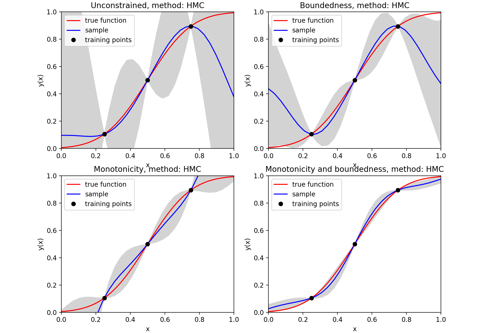

# Constrained_GaussianProcess

Constrained_GaussianProcess is able to deal with linear inequality constraints in Gaussian Process frameworks. Check out the paper [Finite-Dimensional Gaussian Approximation with Linear Inequality Constraints](https://epubs.siam.org/doi/pdf/10.1137/17M1153157) for a detail explanation.



There are also [Hamiltonian Monte Carlo](https://arxiv.org/abs/1208.4118) method and Gibbs sampling method to sample from truncated multivariate Gaussian.


## Requirement

The code requires [Python 3.7](https://www.python.org/downloads/release/python-373/) , as well as the following python libraries:

- [cvxpy](https://www.cvxpy.org/#)==1.0.25
- numpy==1.17.3
- scipy==1.2.1

Those modules can be installed using: `pip install numpy scipy cvxpy` or `pip install -r requirements.txt`.


## Installation

Use the package manager [pip](https://pip.pypa.io/en/stable/) to install Constrained_GaussianProcess.

```bash
pip install Constrained-GaussianProcess
```


## Usage


```python
from Constrained_GaussianProcess import ConstrainedGP
m=30
# specify the constraints
constraints={'increasing': True, 'bounded': [0,1], 'convex': False}  
interval=[0,1]
Gp = ConstrainedGP(m, constraints=constraints, interval=interval)

# Training data
x_train = np.array([0.25, 0.5, 0.75])
y_train = norm().cdf((x-0.5)/0.2)

# the MCMC methods are used to approximate the posterior distribution, 
# so apart from training data, 'method' ('HMC' or 'Gibbs'), required number of samples 
# 'n' and the burn in numbers 'burn_in' should be specified when fitting the data.
Gp.fit_gp(x_train, y_train, n=100, burn_in=100, method='HMC')

x_test = np.arange(0, 1 + 0.01, 0.5)
y_pred = Gp.mean(x_test)  # get the conditional mean
```


)

Sampling from  with constraints 

```python
from Constrained_GaussianProcess import tmg

# set the number of samples and number in burn in phase
n = 150  
burn_in = 30

#Define the covariance matrix and mean vector
M = np.array([[0.5, -0.4], [-0.4, 0.5]])  
mu = np.array([0,0])

# Set initial point for the Markov chain
initial = np.array([4,1])

# Define two linear constraints
f = np.array([[1,1],[1,0]])
g = np.array([0,0])

# Sample 
samples = tmg(n, mu, M, initial, f, g, burn_in=burn_in)
```


## Acknowledment

The `HMC` method for MCMC is based on  the R package [tmg](https://cran.r-project.org/web/packages/tmg/index.html).


## License

[MIT](https://choosealicense.com/licenses/mit/)
